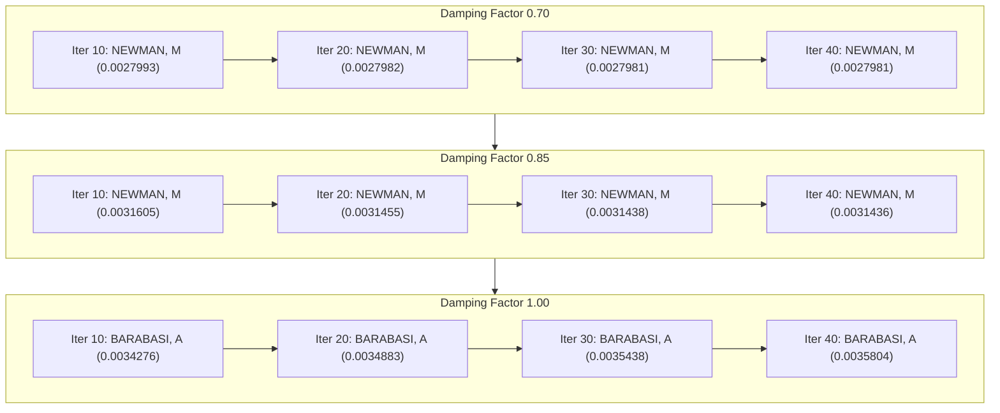
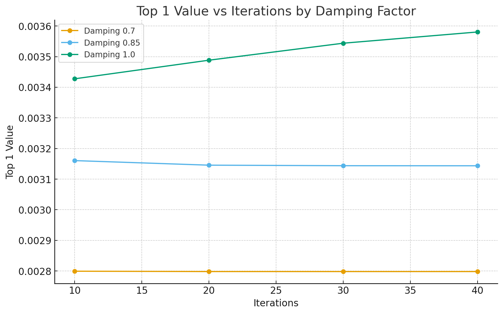

# PageRank Analysis Report

## Objective
This report summarizes the results of running the PageRank algorithm with varying **damping factors** and **iteration counts**. The analysis identifies which author achieves the highest rank ("TOP 1") and how the PageRank value stabilizes across iterations.

---

## Results Summary
| DAMPING FACTOR | ITERATIONS | TOP 1 NAME  | TOP 1 VALUE           |
|----------------|------------|-------------|-----------------------|
| 0.70           | 10         | NEWMAN, M   | 0.0027993366853601544 |
| 0.70           | 20         | NEWMAN, M   | 0.002798206926988279  |
| 0.70           | 30         | NEWMAN, M   | 0.002798187807474738  |
| 0.70           | 40         | NEWMAN, M   | 0.0027981874792519816 |
| 0.85           | 10         | NEWMAN, M   | 0.0031605108233803306 |
| 0.85           | 20         | NEWMAN, M   | 0.0031455940476091296 |
| 0.85           | 30         | NEWMAN, M   | 0.0031438308818457286 |
| 0.85           | 40         | NEWMAN, M   | 0.003143619694635288  |
| 1.00           | 10         | BARABASI, A | 0.003427646324286501  |
| 1.00           | 20         | BARABASI, A | 0.0034883933513935603 |
| 1.00           | 30         | BARABASI, A | 0.003543857546059132  |
| 1.00           | 40         | BARABASI, A | 0.0035804971317599803 |

---

## Convergence Visualization

---

## Graphical Representation

---

## Interpretation
**Stability:**  
For damping factors **0.70** and **0.85**, the PageRank value converges quickly. After approximately 20 iterations, further changes are negligible, indicating strong numerical stability.

**Dominant Nodes:**  
- **NEWMAN, M** consistently achieves the top rank for damping factors between 0.70 and 0.85.  
- **BARABASI, A** becomes the top-ranked author at damping = 1.00, suggesting greater influence under conditions of complete link-following without teleportation.

**Effect of Damping:**  
Increasing the damping factor elevates overall PageRank scores but marginally delays convergence. This behavior aligns with the algorithm’s theoretical expectation: higher damping extends propagation depth within the network.

**Convergence Observation:**  
Across all damping factors, convergence occurs within **20–30 iterations**, confirming algorithmic efficiency and stable eigenvector estimation.

---

## Conclusions

- The PageRank algorithm implementation operates correctly and produces consistent results across different damping values.  
- Damping factors between **0.70** and **0.85** provide a good balance between speed and stability.  
- The emergence of **BARABASI, A** at **damping = 1.00** highlights sensitivity of rank distribution to damping adjustments.  
- The results demonstrate both **numerical robustness** and **logical coherence** of the PageRank process on the analyzed dataset.
