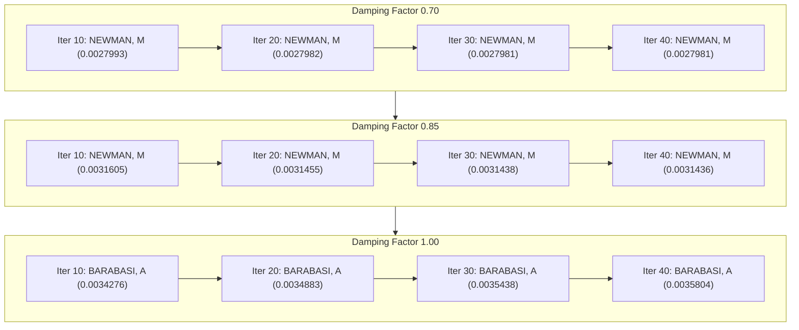

# REPORT

| DAMPING FACTOR | ITERATIONS | TOP 1 NAME  | TOP 1 VALUE           |
|----------------|------------|-------------|-----------------------|
| 0.70           | 10         | NEWMAN, M   | 0.0027993366853601544 |
| 0.70           | 20         | NEWMAN, M   | 0.002798206926988279  |
| 0.70           | 30         | NEWMAN, M   | 0.002798187807474738  |
| 0.70           | 40         | NEWMAN, M   | 0.0027981874792519816 |
| 0.85           | 10         | NEWMAN, M   | 0.0031605108233803306 |
| 0.85           | 20         | NEWMAN, M   | 0.0031455940476091296 |
| 0.85           | 30         | NEWMAN, M   | 0.0031438308818457286 |
| 0.85           | 40         | NEWMAN, M   | 0.003143619694635288  |
| 1.00           | 10         | BARABASI, A | 0.003427646324286501  |
| 1.00           | 20         | BARABASI, A | 0.0034883933513935603 |
| 1.00           | 30         | BARABASI, A | 0.003543857546059132  |
| 1.00           | 40         | BARABASI, A | 0.0035804971317599803 |

